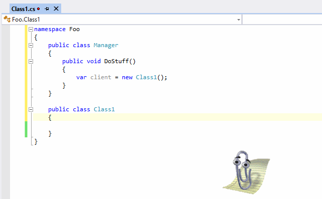
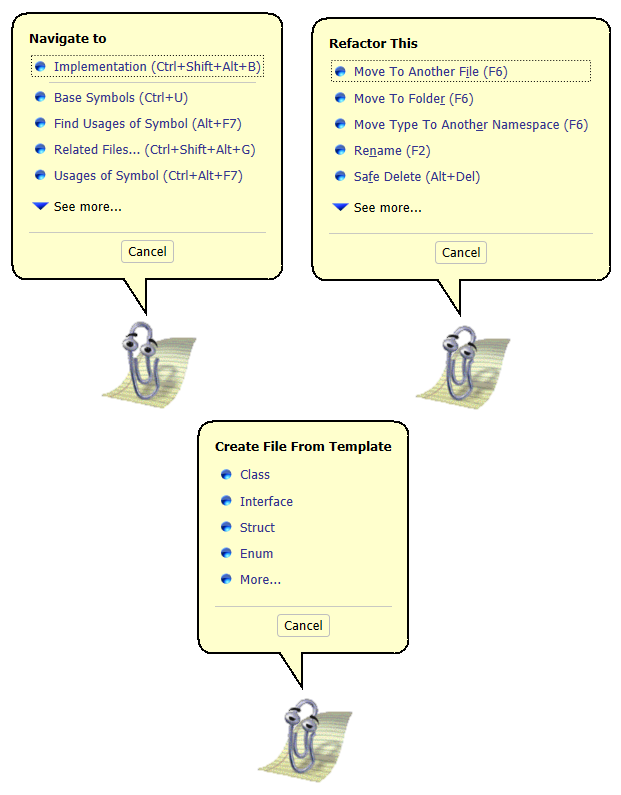
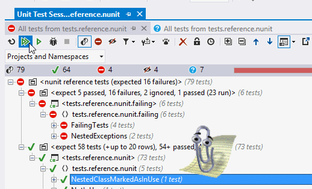

# Clippy for ReSharper #

ReSharper is, obviously, awesome. It does so much for you already, what could you possibly add to make life even more awesomer?

Clippy. That's what.

This is a plugin for ReSharper to add Clippy support to your day to day ReSharper activities. It's fully operational. It handles/takes over:

* Alt+Enter
* Navigate To shortcut
* Refactor This shortcut
* Inspect This shortcut
* Generate (class, ctor, equality, etc) and Generate From Template shortcuts
* Go to recent files and go to recent edits
* In place refactoring, such as renaming a variable or class (my favourite)
* Reporting unit test runs
* Various animations for build, running unit tests, saving, etc.

And it provides a simple menu of items when you click Clippy, providing quick access to the Refactoring, Navigate, Analyze and Generate methods, as well as Code Cleanup, Find Usages and Go to Symbol.

You can install it using the Extension Manager. Go to ReSharper -> Extension Manager -> Online and search for "clippy". Once installed, there's nothing more you need to do, just open a solution and off you go. Clippy will popup and intercept all your favourite keystrokes.

For more information, [see the original blog post](http://blog.jetbrains.com/dotnet/2014/04/01/clippy-for-resharper).

## Building ##

This extension uses the open source [Double Agent](http://doubleagent.sourceforge.net/) library to host the Agent. Some minor changes were made for the binary that is shipped - patches are included in the repo. It also does some nice side-by-side activation context to load an unregistered COM object. Thanks to [Samuel Jack](http://blog.functionalfun.net/2012/09/a-quick-guide-to-registration-free-com.html), [Spike McLarty](http://www.atalasoft.com/blogs/spikemclarty/february-2012/dynamically-testing-an-activex-control-from-c-and) and [Junfeng Zhang](http://blogs.msdn.com/b/junfeng/archive/2006/04/20/579748.aspx) for notes on getting that working. See the [src/resharper-clippy/readme.md](src/resharper-clippy/readme.md) for more details. 

It also uses the ReSharper SDK, which is referenced as NuGet packages.
